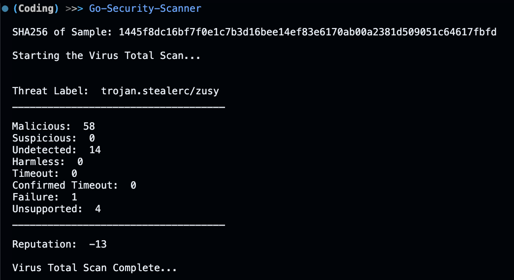

# Go Security Scanner
A GO TUI application that makes a call to the Virus Total API and pulls information regarding a specified SHA-256 hash.

## Usage
- Make a `.env` file and add the key `apikey` to the file and input the apikey: 
    - Ex: `apikey=ENTERKEYHERE`

    - Virus Totals website -> Click Profile -> API Key

## TODO
- Implement Bubbletea and Lipgloss
- Implement Testing for API
